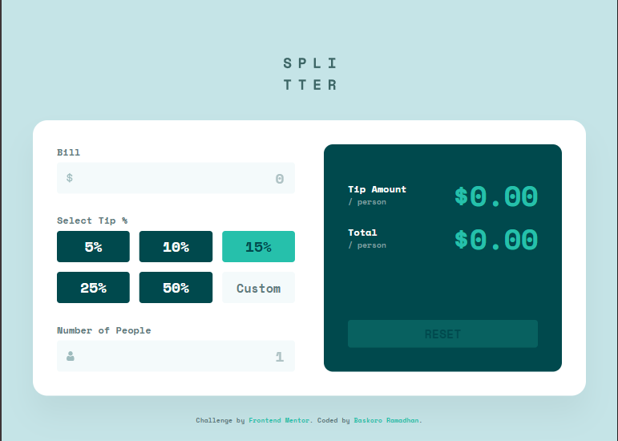
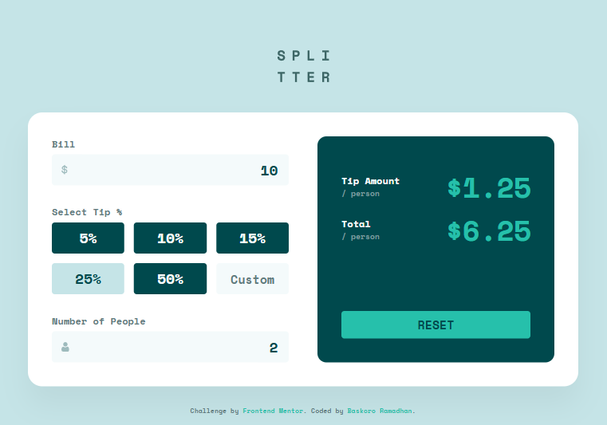

# Frontend Mentor - Tip Calculator App Solution

This is a solution to the [Tip calculator app challenge on Frontend Mentor](https://www.frontendmentor.io/challenges/tip-calculator-app-ugJNGbJUX). Frontend Mentor challenges help you improve your coding skills by building realistic projects.

## Table of contents

- [Overview](#overview)
  - [The challenge](#the-challenge)
  - [Screenshot](#screenshot)
  - [Links](#links)
- [My process](#my-process)
  - [Built with](#built-with)
  - [What I learned](#what-i-learned)
- [Author](#author)

## Overview

### The challenge

Users should be able to:

- View the optimal layout for the app depending on their device's screen size
- See hover states for all interactive elements on the page
- Calculate the correct tip and total cost of the bill per person
- See error messages when the number of people input is zero

### Screenshot

|        Desktop Version               |        Mobile Version              |       Active States              |
| :---------------------------:        | :--------------------------:       | :------------------------:       |
|  |  |  |

### Links

- Solution URL: [https://github.com/BaskoroR725/12-tip-calculator-app-js.git]
- Live Site URL: [https://baskoror725.github.io/12-tip-calculator-app-js/]

## My process

### Built with

- Semantic HTML5 markup
- CSS Custom Properties (Variables)
- Flexbox and CSS Grid
- Mobile-first workflow
- [Sass/SCSS](https://sass-lang.com/)
- Modern JavaScript (ES6+) - State management and DOM manipulation

### What I learned

This project was a great exercise in maintaining a "Single Source of Truth" between the UI and the application logic.

**1. Scalable Sass Architecture:**
I implemented a modular Sass structure to keep the code maintainable. Using `@use` instead of `@import` ensured a clean namespace.

**2. Fluid Typography with `clamp()`:**
Instead of relying solely on media queries, I used the `clamp()` function to create fluid text that scales between mobile and desktop sizes.

```css
.result-item__value {
  font-size: clamp(2rem, 8vw, 3rem);
}
```

**3. Defensive Programming in JS :**
I learned to handle edge cases like "zero" inputs and "NaN" (Not a Number) results when users clear the input fields.

```js
billValue = Math.abs(parseFloat(billInput.value)) || 0;
```

### Author

- Baskoro Ramadhan.
